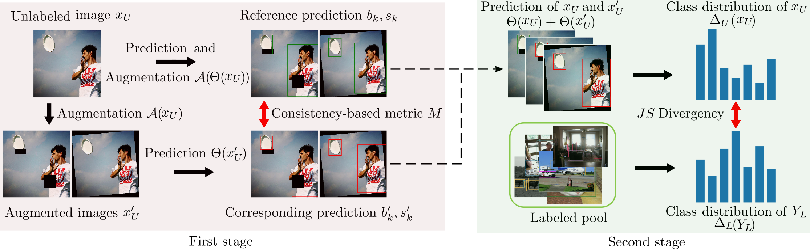
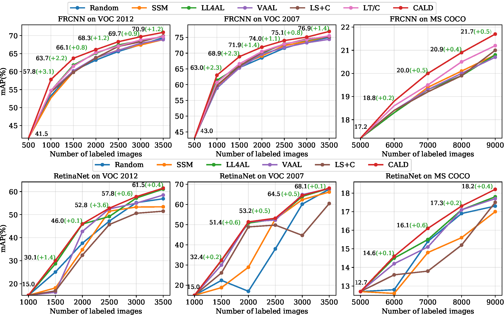

# Consistency-basd Active Learning for Object Detection

## Introduction
This repo is the official implementation of CALD: [**Consistency-basd Active Learning for Object Detection**](https://arxiv.org/abs/2103.10374)

. 

## Requirement
- pytorch>=1.7.1
- torch=0.8.2

(option if you want to get class-wise results of coco)

- mmcv=1.0.4
- pycocotools=2.0.2
- terminaltables=3.1.0
## Quick start
```
python cald_train.py --dataset voc2012 --data-path your_data_path --model faster
``` 
* 方法一：按照下列数据存放规则，每次需要维护`labeled_annotation`，`unlabeled_imgid`以及`oracle_imgid`。并且每次需要更新`unlabeled_pool`，`labeled_pool`以及`oracle_pool`
```
//data01/zyh/ALDataset
|—— annotations
|   |—— labeled_annotation.json
|   |—— test_annotation.json
|   |—— unlabeled_imgid.txt
|   |—— oracle_imgid.txt
|—— unlabeled_pool
|—— labeled_pool
|—— test_pool
|—— oracle_pool
```

* $\bf{Task}$
1. 将原有`BITVehicle`数据集选择一种规则存放
2. 反向排序`Metric`，选取一定`budget`图片
3. 输出并维护`oracle_imgid`和`unlabeled_imgid`

程序流程：
在得到uncertainty之后进行两次排序，
正向排序：越小代表越不准，放到oracle里面
反向排序：越小代表越准，放到labeled_pool里面

有一个问题是：原本论文觉得选择的图片应该尽量和已选择的图片的class差别尽量大一点好，但是我们这边需要考虑这个问题吗？

TODO:
1. 先让模型运行起来并不要报错
2. 确认oracle_pool里面确实存放不准的图片
3. 将oracle_imgid写入txt文件