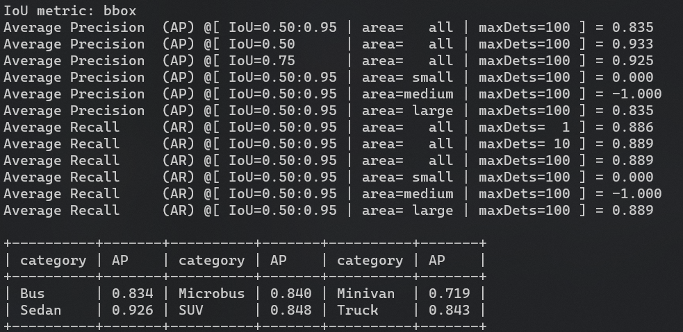
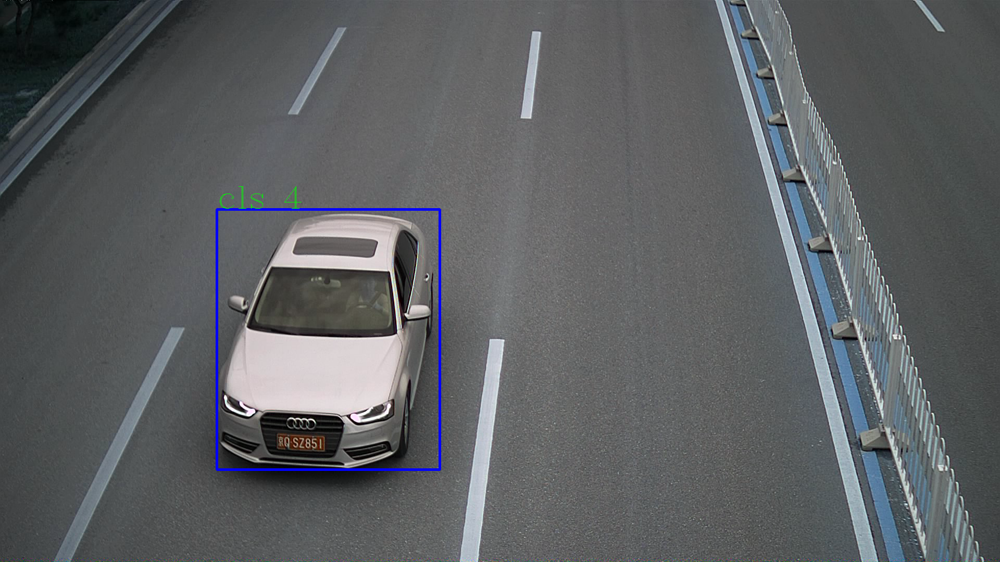

# Consistency-basd Active Learning for Object Detection

## Introduction
This repo is the official implementation of CALD: [**Consistency-basd Active Learning for Object Detection**](https://arxiv.org/abs/2103.10374)

. 

## Requirement
- pytorch>=1.7.1
- torch=0.8.2

(option if you want to get class-wise results of coco)

- mmcv=1.0.4
- pycocotools=2.0.2
- terminaltables=3.1.0
## Quick start
```
python cald_train.py --dataset coco --data-path your_data_path
``` 
# 中文介绍
本仓库为Dian团队智慧交通组开发，一款可以用于自动打标的脚本。基础代码仓库参考于https://github.com/we1pingyu/CALD，我们在其中进行了一部分删改，具体包括：
1. 搭建所有自动打标工作流，初始时刻图片分为labeled_pool和unlabeled_pool，前者有人工打标，后者为纯图片。每次模型在labeled_pool中训练，在unlabeled_pool中计算每张图片的难易程度，将一部分容易的图片放入labeled_pool中，并且将模型输出结果作为真实标注，将一部分困难的图片放入oracle_pool中等待人工打标。
2. 加入COCO2labelme脚本，方便重新二次打标。
3. 数据可视化输出。

在BITVehicle_Dataset数据集上运行结果。


